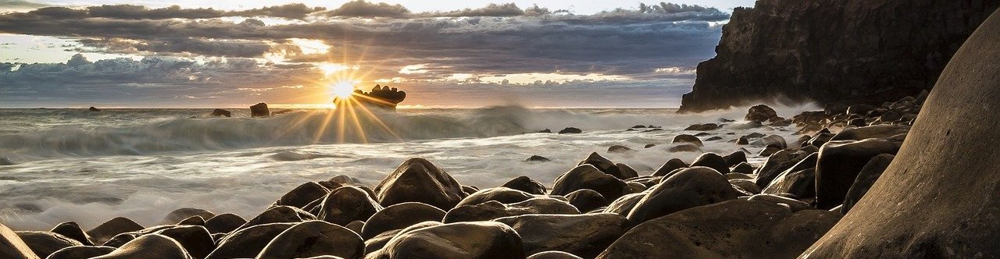

# Home

## Definitions and Terms

### Alternate assessment types

- 

## Acknowledgements

- The [logo](https://pixabay.com/photos/school-abacus-count-learn-4571739/) is of an Abacus from Pixabay, by user [councilcle](https://pixabay.com/users/councilcle-14038644/).

- The [header](https://pixabay.com/photos/rocks-beach-sea-ocean-sun-sunset-1239727/) is of a rocky beach from Pixabay, by user [martynz](https://pixabay.com/users/martynz-2169007/).